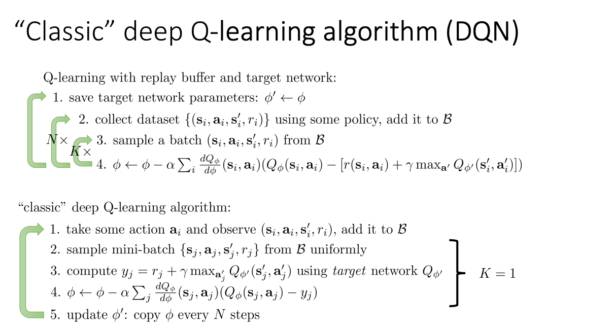

This is for deep Q learning

* slow update for target network (phi') and online update for quick network phi
* use phi for data collection and put it into a buffer
* sample from buffer for gradient update to update phi for K iterations
* When updating gradient, use phi' to compute the predicted value for any state.

how to update phi' (moving average)
how to compute the predicted value, using a combination of phi and phi' (double q learning)
multi-step return to reduce variance
continuaous action space:
 - sampling to get the sampled max
 - use a function class to approximate
 - learn a maximizer u_theta(s) ~= argmax_a Q_phi(s, a). This is DDPG (Deep Deterministic Policy Gradient)

Some tips:
 - clip gradient or use huber loss to reduce bellman error
 - double q learning always helps
 - Mult step return helps
 - tune: exploration rate, learning rate, random seed and use adam optimizer