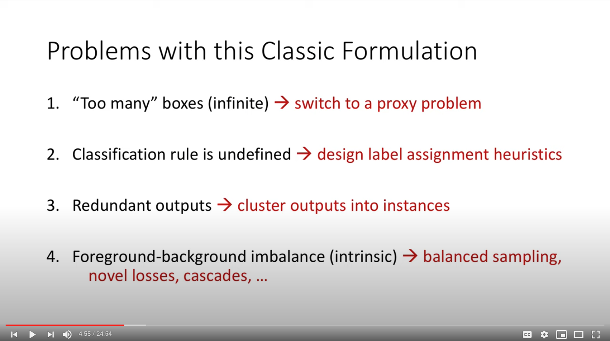
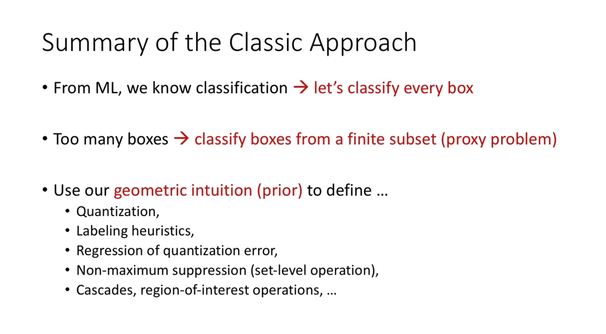
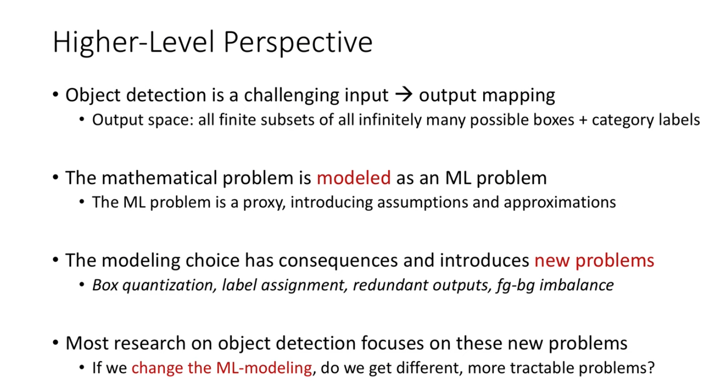

[Object Detection as a Machine Learning Problem](https://www.youtube.com/watch?v=her4_rzx09o&list=PLVmR_iWVC7UEpsaxoBcl-jp2rmlEKB-ob&index=2)
------

__keywords__: OD

### __Discription__:
This is the lecture given by Ross Girshick at ECCV 2020 tutorial.

  

### __Note__:

* Reflecting on the ML-based Object Detection (OD) framework, it aims to classify and regress predefined geometry-based regions (point, box, etc.). This is because in ML model, the classification problem has been extensively studied, yet the object detection problem is not. As a result, we are trying to solve the object detection by reducing it to a classification problem (plus regression for refinement) in essence.

* Here are all the subsequent problems with such classification formulation:

* Meanwhile, we tried to address the problems based on our geometric intuition (prior):

* Taking a higher-level perspective, most of efforts in the field is not solving the OD problem itself. Instead, it is solving subsequent problems resulting from the surrogate classification problem:

* One emerging work to take on the problem from a totally different perspective is the [DETR](https://arxiv.org/pdf/2005.12872.pdf), which shows promising direction to transform the object detection field.
