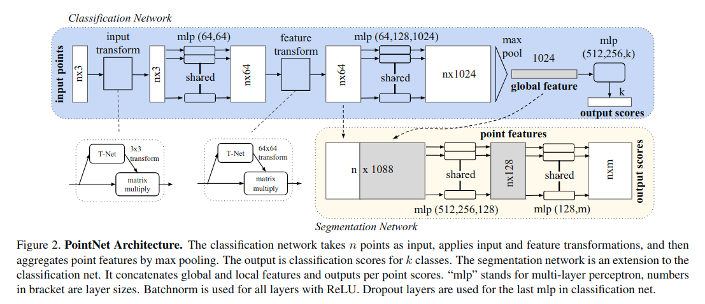

[Robot Learning with Super-Linear Scaling](https://arxiv.org/pdf/2412.01770) [RSS 25]
---------------	

__TL;DR__: blablablablabla

__keywords__: bla-bla

__Resources__: [[Github](blabla)] 

__Other Notable Info__: [Project Page](https://casher-robot-learning.github.io/CASHER/)

     

General Comments:
------
* Real-to-Sim-to-real: real visual, real geometry, real physics. 
* TeleOp in simulation
* human demo + RL to train model (RL bootstrapped with human demo)
* Train many single enviroment models first, and then use distillation to train a multi-envirment, generalist model.
* A video scan of the environment + some demo in the sim, without robots. How come? How valuable is this data?

Key ideas and technical details:
------
* 
* 

Other noteworthy points:
------
* 
* 

Other thoughts:
------
* What are the robotic knowledge (robotic assets):
    - Raw trajectory data, which is easy to get in simulation
    - good or bad labels
    - high quality (expert) trajectory data
    - a qualified capable model (can generate okay trajectory)
* Model can do in a single environment very well. Does it make sense?
* We get many intermediate okay models though iterations. What are uses of OKAY models?

Screenshots:
------
<!--  -->

