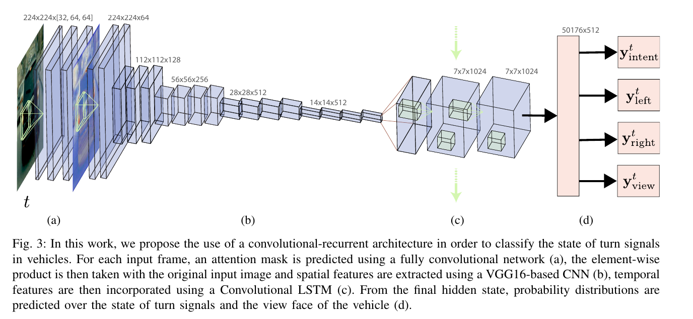

[DeepSignals: Predicting Intent of Drivers Through Visual Signals](https://arxiv.org/abs/1905.01333)
======

__Publication__: ICRA 2019

__Affiliation__: Uber

__Author__: Davi Frossard

__Group__: [Raquel Urtasun in Uber ATG](https://www.cs.toronto.edu/~urtasun/index.html)

__Sources__: ([Github]) ([Paper](https://arxiv.org/abs/1905.01333)) 

     

__Rating__: 4/5
  

General Comments:
------
* CNN to extract feature with spatial attention
* ConvLSTM to extract time-related feature
* A solid engineering work, but lack of comparing with real SOTA performance.
* Temporal attention model not used 

Main Innovations:
------
* Combining the convLSTM with attention-based CNN features

Worth-noting:
------
* Used dilated conv to generate attention map
* Impose both intent loss and view loss as multi-tasking
* Neither LayerNorm nor BatchNorm can do any help

Pictures:
------

