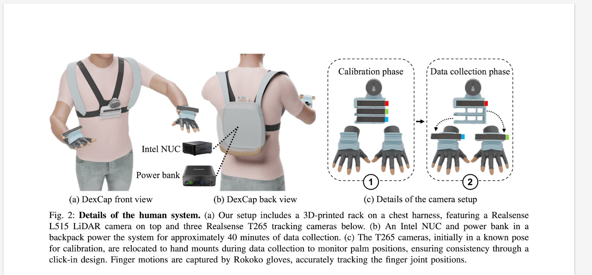

[DexCap: Scalable and Portable Mocap Data Collection System for Dexterous Manipulation ](https://arxiv.org/pdf/2403.07788) [RSS 2024]
---------------	

<!-- __TL;DR__: blablablablabla -->

__keywords__: IL, 

__Resources__: [[Github](https://github.com/j96w/DexCap)] 

__Other Notable Info__: [project website](https://dex-cap.github.io/)

   

General Comments:
------
* Paper from Feifei Li team
* DexCap: a system use electromagnetic field (EMF) and SLAM for motion capture (MoCap), to offer high precision and occlusion-resistant tracking
* DexIL: use inverse kinematics and point-cloud based imitation learning to learn from human demonstration
* Human-in-the-Loop Correction: a human-in-the-loop correction mechanism with DEXCAP, significantly enhancing robot performance in complex tasks.
* Human demonstration, captured by MoCap, and then retargeted into robot hands. Modify the point cloud visual input a bit to account for the human-robot hand difference. Use IL and diffusion policy. Human-in-the-Loop Correction is to have a human teleoperation to be ready to take over.
* My question, how to determine human take over? Does the human need to teleoperate the robot all the time to compute the degree of delta? How often does the takeover happen?

Key ideas and technical details:
------
* DexIL： use point-cloud, and consistent coordinate frame as observation (o)
* use the robot hands to replace the human hands in the observation data
* diffusion policy to predict future d steps actions
* Human-in-the-Loop Correction: measure the delta diff between the human hands and the robot hands and the delta is applied to the subsquent policy rollouts. If the delta is too high, then will fall back to the teleop mode. The teleop is also done through human hand tracking and IK retargeting in real time.
* The very interesting thing is that no on-robot data is needed, only human demonstration.
* use point-cloud and make sure a stable and consistent coordinate frame to account for the camera movement during data collection is the key to generalize from human to robot. On the contrary, image-based approaches are more effective in learning with fixed camera view.

Other noteworthy points:
------
* Figure 15 and Table VIII present qualitative and quantitative
results, respectively. We observe that the IMU-based method
suffers from pose drifting during tracking, while our SLAMIMU approach more accurately tracks hand poses, with an
average error of **0.8 cm** compared to the **11.3 cm** error of the
IMU-based method.
* 

Screenshots:
------

https://www.rokoko.com/products/smartgloves

