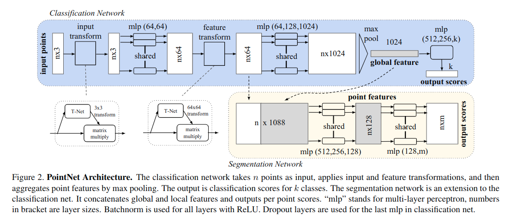

[DiffusionDrive: Truncated Diffusion Model for End-to-End Autonomous Driving](https://arxiv.org/pdf/2411.15139) [CVPR XXX]
---------------	

__TL;DR__: blablablablabla

__keywords__: bla-bla

__Resources__: [[Github](blabla)] 

__Other Notable Info__: [blabla](blabla)

     

General Comments:
------
* Borrowed idea from diffusion policy.
* Use kmeans to get k anchors, and then diffuse the k anchors to k gaussion noises.
* in denoising, only the GT anchor is denoised, targeting the GT trajectory ()
* another cls loss is applied to each anchor.
* in inference, all the anchors are sampled, and use cls prob to determine which anchor to use.

Key ideas and technical details:
------
* diffusion is like a flavor of regression. from sampled noise to regress a result.
* it's also like a distribution mapping. the start point is a random sample 
from a noisy distribution, the end point is one of the sample from the target distribution,
e.g.  an image or a trajectory.

Other noteworthy points:
------
* 
* 

Screenshots:
------
<!--  -->

