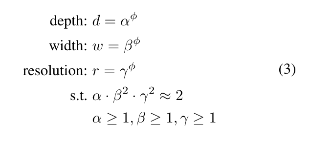
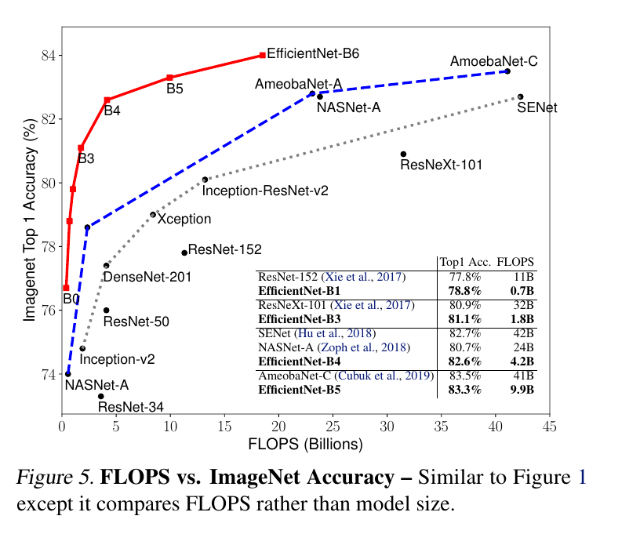

[EfficientNet: Rethinking Model Scaling for Convolutional Neural Networks](https://arxiv.org/abs/1905.11946)
======

__Publication__: ICML 2019

__Affiliation__: Google

__Author__: [Mingxing Tan](https://scholar.google.com/citations?user=6POeyBoAAAAJ&hl=en)

__Group__: 

__Sources__: ([Github](https://github.com/lukemelas/EfficientNet-PyTorch))

     

__Rating__: 5/5
  

General Comments:
------
* A reverse-thinking, we can start from a very small but relatively effective model, and scale it up to boost its performance to the greatest extent.
* Once a start point is established, the only problem left is how to determine the scale-up factors for resolution (\alpha), depth (\beta), and width (\gamma).
* The method is simple but effective, to determine a good combination of (\alpha, \beta, \gamma), the paper did grid search.
* Once the best combination is decided, simply add a exponential term to scale the model up.
* The start point network is MobileNet and ResNet in this paper. 

Main Innovations:
------
* Reverse-thinking. Scale models up.

Worth-noting:
------

Pictures:
------

