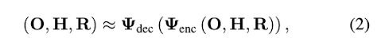
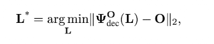

[Learning to Transfer Human Hand Skills for Robot Manipulations](https://arxiv.org/pdf/2501.04169) [CoRL Workshop 2024]
---------------	

__TL;DR__: Using MoCap to log human manipulation data, and then use algorithm to transfer the humand
data into robot hand manipulation data. In short, transfer data from human hand embodiment to
robot hand embodiment

<!-- __keywords__: bla-bla -->

<!-- __Resources__: [[Github](https://rureadyo.github.io/MocapRobot/)]  -->

__Other Notable Info__: [Project Page](https://rureadyo.github.io/MocapRobot/)

     

General Comments:
------
* This research is much needed. Transfering human data into robot data is the only
scalable way to cost-effective collect robot data.
* 

Key ideas and technical details:
------
* The core idea is to project data into a latent space (manifold space),
and than use the optimization based method to find the optimized latent code that
best fit into the optimization objective ---- the object movement in this case.
* Once the optimized latent code is found, it's easy to decode the corresponding
robot movement/control info.

where O is object, H is human hand movement, and R is robot hand movement.
* The above two equations are the key framework. This framework will be repeated
multiple times to construct data pairs and to learn different manifold.

Other noteworthy points:
------
* To learn \phi(O, H, R), we need to construct (O, H, R) tuples.
* To get the (O, H, R) tuples, we need to infer H from (O, R) pair.
* To infer H, we need to construct (O, H) manifold and use latent code optimization
approach to solve H. And thus, we need to collect  (O, H) dataset.
* Everytime we solve optimized latent code, we use IK to initialize human hand (or robot hand), to get an intialized latent code.

My thoughts:
------
* The optimization goal is always the object movement. But it's a under-constrained
optimizaiton problem in theory, because one object movement could corresponds to
multiple robot/human hand movement.
* One way to improve this from hardware side is to incorporate tactile sensing.
If the robot and human wearing the same tactile devices. We can add the tactile sensing
readings as an additional objective, and hence increase the contraints. 
* How to regulate the robot/human hand positions with tactile sensing result, is another
technnical difficulty.
* The manifold space has to be learned very well to make sure the decoded (O, H)
pairs, or (O, H, R) tuples are actually sensible.

Screenshots:
------
<!--  -->

