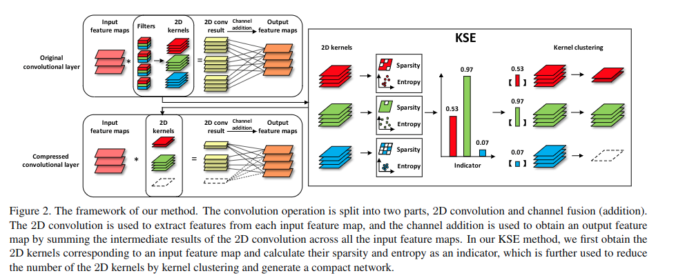

[Exploiting Kernel Sparsity and Entropy for Interpretable CNN Compression](https://arxiv.org/abs/1812.04368)
======

__Publication__: CVPR 2019

__Affiliation__: Fujian Key Laboratory of Sensing and Computing for Smart City, Department of Cognitive Science

__Author__: Yuchao Li

__Group__: Rongrong Ji

__Sources__: ([Github](https://github.com/yuchaoli/KSE)) ([Paper](https://arxiv.org/abs/1612.00593)) ([Website](http://stanford.edu/~rqi/pointnet/))

     

__Rating__: 5/5
  

General Comments:
------
* A big potential problem with a lot of CNN pruning methods is that after prunning, the dimensions of each layer will change, which can raise problems for networks with shortcut connections (e.g. ResNet).
* Therefore, this paper propose a method to reduce # of filters in the network but still keep the dimensions at each layer.
* The way to achieve the aforementioned is by taking a 2-D conv perspective and use K-means to group 2D filters.
* Another innovation is that the paper make us of both filter sparsity and filter entropy to indicate feature map sparsity and info richness. Those properties are encoded in the indicator KSE.
* The effectiveness of the KSE indicator is theorectially proven (not very convincing), also experimentally demonstrated by visualizing them.

Main Innovations:
------
* 2D conv kernel perspective
* K-means methods
* Both kernel sparsity and entropy.

Worth-noting:
------
* 
* 

Pictures:
------

