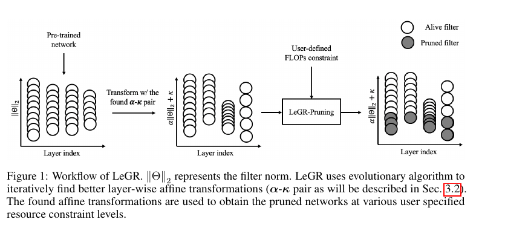
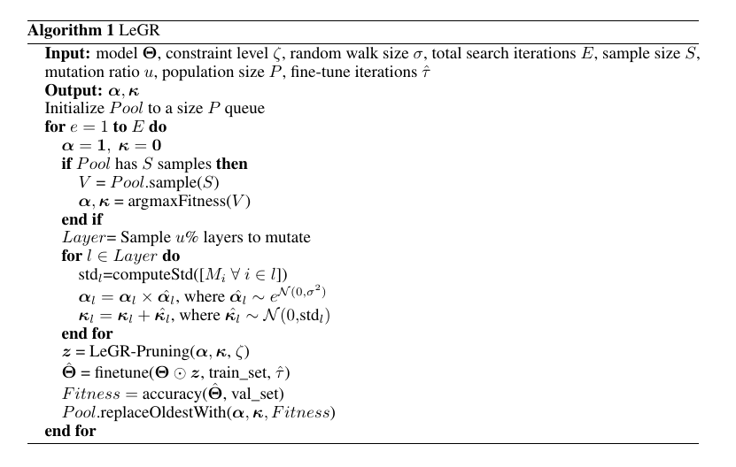

[LeGR: Filter Pruning via Learned Global Ranking](https://arxiv.org/abs/1904.12368)
======

__Publication__: CVPR 2019

__Affiliation__: CMU

__Author__: TIng-WU Chin

__Group__: 

__Sources__: ([Github](https://github.com/cmu-enyac/LeGR)) 

     

__Rating__: 5/5
  

General Comments:
------
* Simple idea: rank all the filers in CNN based on the importance. Importance is defined as the influence to the loss function.
* First calculate the L2 norm of each filter. Then transform the norm for each filter by a \alpha-\kappa transform pair. 
* The key is how to get the \alpha-\kappa transform pair.
* It seems that the author used evolutionary learning to learn \alpha-\kappa for each filter. The criterion is the accuracy drop for different \alpha-\kappa values.
* The paper has very good and thorough introduction.
* The result from this paper outperforms the result from AutoML compression.

Main Innovations:
------

Worth-noting:
------
* 
* 

Pictures:
------

