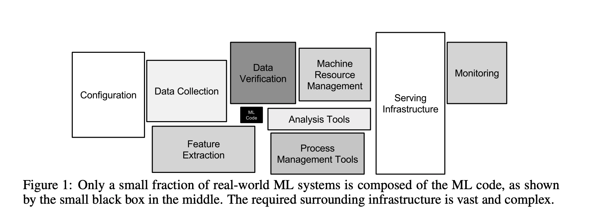
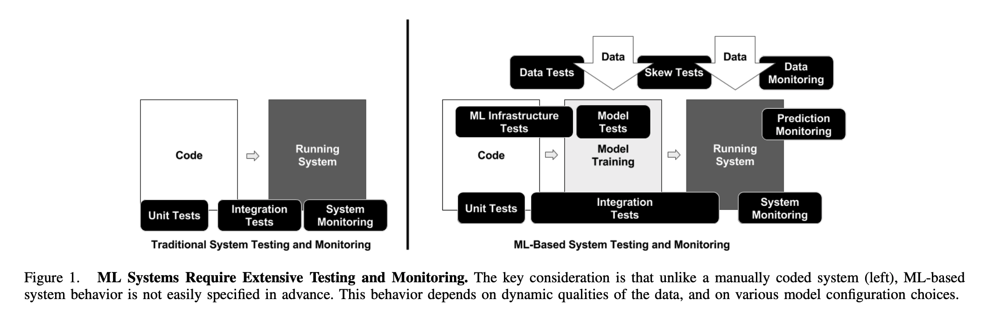

[Hidden Technical Debt in Machine Learning Systems](https://papers.nips.cc/paper/5656-hidden-technical-debt-in-machine-learning-systems.pdf) [NeurIPS 15]
---------------	

General Comments:
------
* Both papers delve into the technical debt in real-life ML system. It provides many insights about how and why the the technical debt can accumulate in ML system
and how to combat the debt and form good practices.
* Due to the data dependancy and the interweaving between the model and the data, the abstraction boundaries in traditional software development is greatly eroded in ML system.
* The data dependancy alone tends to be more messy and costy than traditional code dependancy. 
* The lack of testing, especially in the data part.

Other noteworthy points:
------
* Glue code, pipeline jungle, dead experimental codepaths are really resonating with real DL algorithm development.

  
  
  

[The ML Test Score: A Rubric for ML Production Readiness and Technical Debt Reduction](https://storage.googleapis.com/pub-tools-public-publication-data/pdf/aad9f93b86b7addfea4c419b9100c6cdd26cacea.pdf) [IEEE BigData 17]
---------------	

General Comments:
------
* This paper takes on a more test-driven approach to develop a disciplined ML software practice. 
* The whole ML system can be broken down to data, mdeol, infra, and monitoring.
* The key idea is that each part has to be fully tested, logged, and eaisy to debug, and easiy to roll back. 

Other noteworthy points:
------
* It is good practice to do sanity check on data by e.g. calculating the statistics of dataset.
* The testing of the model has to be thorough and specific to sub-groups. 
* The importance of checklist in practice. 

