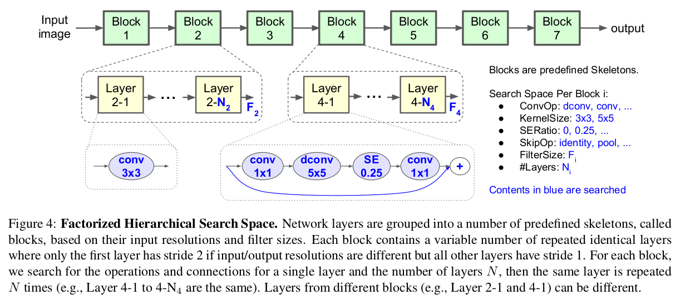

[MnasNet: Platform-Aware Neural Architecture Search for Mobile](https://arxiv.org/abs/1807.11626)
======

__Publication__: 2018 CVPR

__Affiliation__: Google

__Author__: [Mingxing Tan](https://ai.google/research/people/105445)

__Group__: Google AI

__Sources__: ([Github](https://github.com/tensorflow/tpu/tree/master/models/official/mnasnet)) ([Paper](https://arxiv.org/abs/1807.11626)

     

__Rating__: 5/5
  

General Comments:
------
* Instead of handcrafting neural network architectures, the authors choose to use RL to automatically design network
* Directly optimized on a phone to optimize the inference latency instead of optimizing the proxies e.g. FLOPS
* Optimized in a large dataset (ImageNet and COCO) instead of small tasks like CIFAR
* Factorized hierarchical search sapce: Network -> Block -> layers -> opeartions

Main Innovations:
------
* All the contents in the above setions
*

Worth-noting:
------
* Integrate the constraint into the objective function. Soft constraint of the latency for the objective function.
* Sampled 3000 models in the search space. The computational cost must be very high

Pictures:
------

