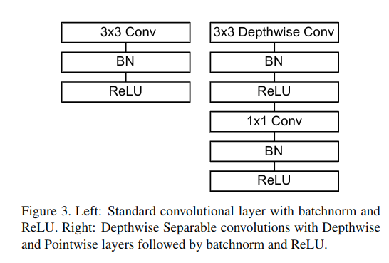
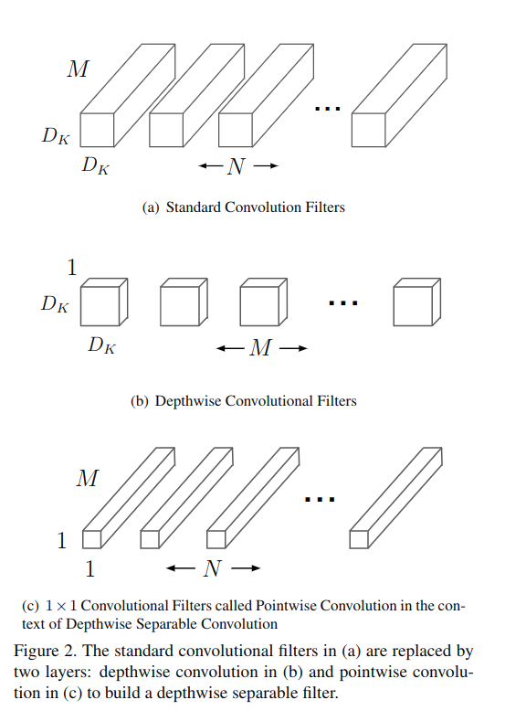

[MobileNets: Efficient Convolutional Neural Networks for Mobile Vision Applications](https://arxiv.org/abs/1704.04861)
======

__Publication__: 2017

__Affiliation__: Google

__Author__: [Andrew G. Howard]

__Group__: Google

__Sources__: ([Github](https://github.com/topics/mobilenets)) ([Paper](https://arxiv.org/abs/1704.04861))
     

__Rating__: 5/5
  

General Comments:
------
* The motivation is to shrink network size without sacrificing the performance too much
* The key innovation is the depthwise sekparable convolution, namely first keep channel # unchanged, then use 1 X 1 conv to change channels
* The idea is simple but effective

Main Innovations:
------
* Depthwise separable convolution
* Width Multiplier: Thinner Models (means adapting the # of channels at each layer)
* Resolution multiplier: reduced representation (means adapting the res of input image)

Worth-noting:
------
* Relevent researches can be generally categorize into: 1. compressing pretrained networks; 2. training small networks directly
* In the implementation, down sampling is handled with strided conv in the depthwise conv as well as in the first layer
* Final average pooling reduces the spatial res to 1 before the fully connected layer
* Used RMSprop as the training algorithm

Pictures:
------

[MobileNetV2: Inverted Residuals and Linear Bottlenecks](https://arxiv.org/abs/1801.04381)
======

__Publication__: 2018

__Affiliation__: Google

__Author__: Mark Sandler

__Group__: Google

__Sources__: ([Github](https://arxiv.org/abs/1801.04381)) ([Paper](https://arxiv.org/abs/1801.04381)) 
     

__Rating__: 5/5
  

General Comments:
------
* The major innovation is the inverted residual with linear bottleneck
* Have some implementation details that can make the system work.
* Tried to argue that the Non-linear activation function such as ReLu can degrade the performance. But not very convincing.
* Did conprehensive experiment to determine some hyper-parameters

Main Innovations:
------
* the inverted residual with linear bottleneck
* Info flow interpretation of the basic module. Capacity and experessiveness

Worth-noting:
------
* We use ReLU6 as the non-linearity because of its robustness when used with low-precision computation. 
* We always use kernel size 3 × 3 as is standard for modern networks, and utilize dropout and batch normalization during training.
* 

Pictures:
------

