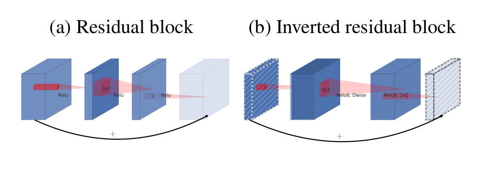
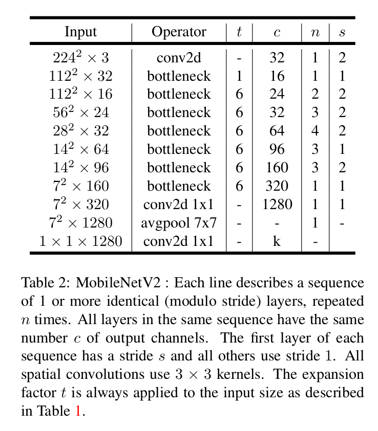
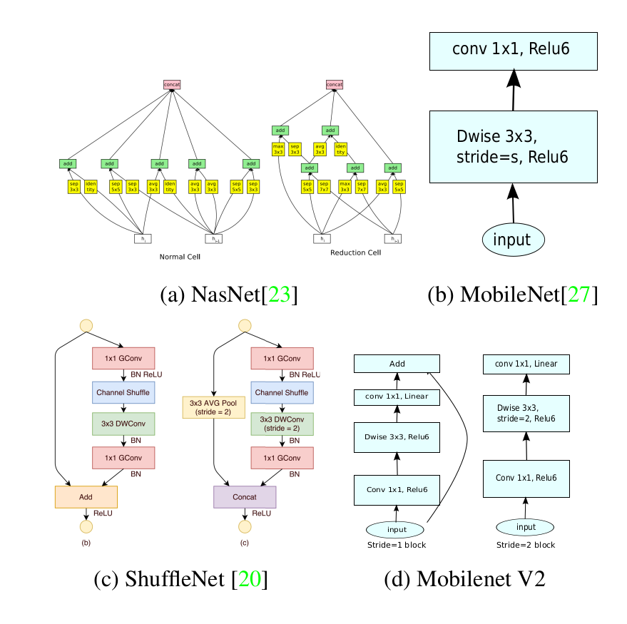
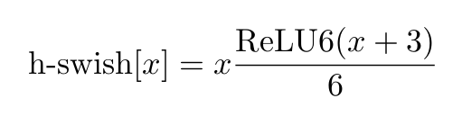
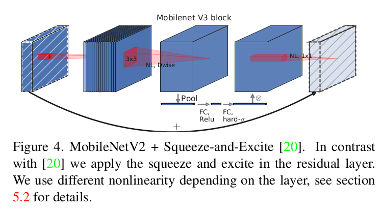
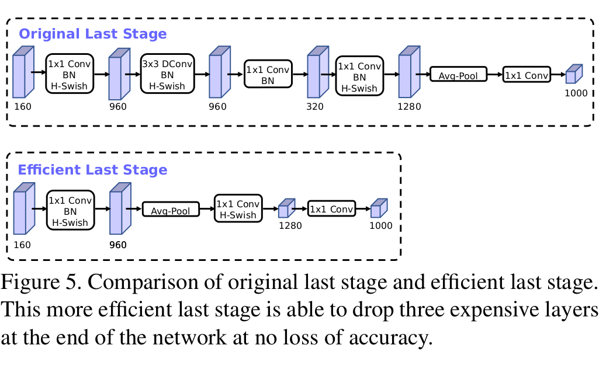
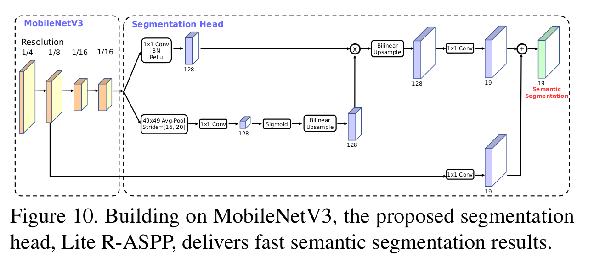

[MobileNets: Efficient Convolutional Neural Networks for Mobile Vision Applications](https://arxiv.org/abs/1704.04861)
======

__Publication__: 2017

__Affiliation__: Google

__Author__: [Andrew G. Howard]

__Group__: Google

__Sources__: ([Github](https://github.com/topics/mobilenets)) ([Paper](https://arxiv.org/abs/1704.04861))
     

__Rating__: 5/5
  

General Comments:
------
* The motivation is to shrink network size without sacrificing the performance too much
* The key innovation is the depthwise sekparable convolution, namely first keep channel # unchanged, then use 1 X 1 conv to change channels
* The idea is simple but effective

Main Innovations:
------
* Depthwise separable convolution
* Width Multiplier: Thinner Models (means adapting the # of channels at each layer)
* Resolution multiplier: reduced representation (means adapting the res of input image)

Worth-noting:
------
* Relevent researches can be generally categorize into: 1. compressing pretrained networks; 2. training small networks directly
* In the implementation, down sampling is handled with strided conv in the depthwise conv as well as in the first layer
* Final average pooling reduces the spatial res to 1 before the fully connected layer
* Used RMSprop as the training algorithm

Pictures:
------

[MobileNetV2: Inverted Residuals and Linear Bottlenecks](https://arxiv.org/abs/1801.04381)
======

__Publication__: 2018

__Affiliation__: Google

__Author__: Mark Sandler

__Group__: Google

__Sources__: ([Github](https://arxiv.org/abs/1801.04381)) ([Paper](https://arxiv.org/abs/1801.04381)) 
     

__Rating__: 5/5
  

General Comments:
------
* The major innovation is the inverted residual with linear bottleneck
* Have some implementation details that can make the system work.
* Tried to argue that the Non-linear activation function such as ReLu can degrade the performance. But not very convincing.
* Did conprehensive experiment to determine some hyper-parameters

Main Innovations:
------
* the inverted residual with linear bottleneck
* Info flow interpretation of the basic module. Capacity and experessiveness

Worth-noting:
------
* We use ReLU6 as the non-linearity because of its robustness when used with low-precision computation. 
* We always use kernel size 3 × 3 as is standard for modern networks, and utilize dropout and batch normalization during training.
* 

Pictures:
------

[Searching for MobileNetV3](https://arxiv.org/abs/1905.02244)
======

__Publication__: 2019

__Affiliation__: Google

__Author__: Andrew Howard

__Group__: Google

__Sources__: ([Github](https://github.com/Bisonai/mobilenetv3-tensorflow)) ([Paper](https://arxiv.org/abs/1801.04381)) 
     

__Rating__: 5/5
  

General Comments:
------
* The authors made further improvements both automatically and manually
* Automatically: used NAS for platform-level search, similar to MnasNet; used NetAdapt for layer-wise search
* Manually: Redesigned expensive layers: initial layer and last layers. For initial layer, used 16 filters instead of 32 filters and used SWISH activation function. For last a few layers, got rid of a lot of redundant layers.
* Also introduced Squeeze-and-Excite module
* Inroduced the hard-swish activation function. Simple, effecient, and effective
* The # of channels in the expension layers of each block is reduced to be 1/4 of previous value
* It is more like a automatical search now. Some conclusion in this paper somehow contradict with previous papers, e.g. the # of channels supposed to use in the expension layer.

Main Innovations:
------
* Same as the above

Worth-noting:
------
* The h-swish is less faster than ReLu, but it can give gains of accuracy

Pictures:
------

