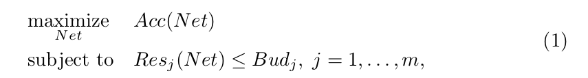
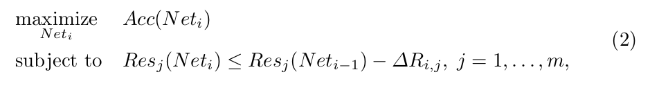
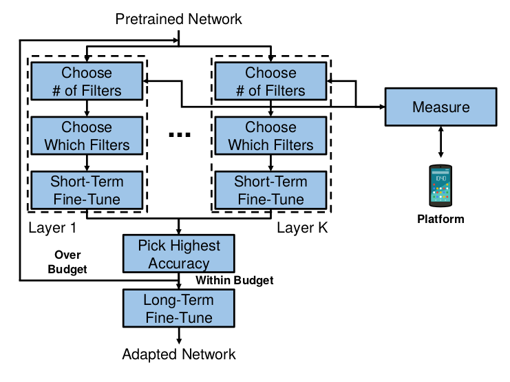

[NetAdapt: Platform-Aware Neural Network Adaptation for Mobile Applications](https://arxiv.org/abs/1804.03230)
======

__Publication__: 2018

__Affiliation__: Google and MIT

__Author__: [Tien-Ju Yang](https://scholar.google.com/citations?hl=en&user=nu5HFrIAAAAJ&view_op=list_works&sortby=pubdate)

__Group__: Google

__Sources__: ([Github](https://github.com/madoibito80/NetAdapt)) ([Paper](https://arxiv.org/abs/1804.03230)) 
     

__Rating__: 5/5
  

General Comments:
------
* Platform-aware algorithm, which means it is optimize for a specific platform
* Given a bunch of budgets for a platform, the network is gradually optimized to meet the budgets while preserving the best performance.

Main Innovations:
------
* The goal is to solve a non-convex constrained problem. To solve it, we can break it down into a series of smaller problems to solve
* Based on a pretrained model, at each iteration choose to reduce how many filter at which layer that can meets the budgets and preserves the performance as well
* At each iteration, the network is fine-tuned (short-term fine-tuning); At the final step, the network is fine-tuned again. (long-term)

Worth-noting:
------
* Compared this method with Multipliers (simply reduce the res or the # of channels at each layer). This method is better.
* After applying this method into MobileNets, there are two interesting observations about what the NetAdapt ended up with:
  * NetAdapt removes more filters in layers 7 to 10, but fewer in layer 6. Since the feature map resolution is reduced in layer 6 but not in layers 7 to 10, we hypothesize that when the feature map resolution is reduced, more filters are needed to avoid creating an information bottleneck.
  * The second observation is that NetAdapt keeps more filters in layer 13 (i.e. the last CONV layer). One possible explanation is that the ImageNet dataset contains one thousand classes, so more feature maps are needed by the last FC layer to do the correct classification.

Pictures:
------

