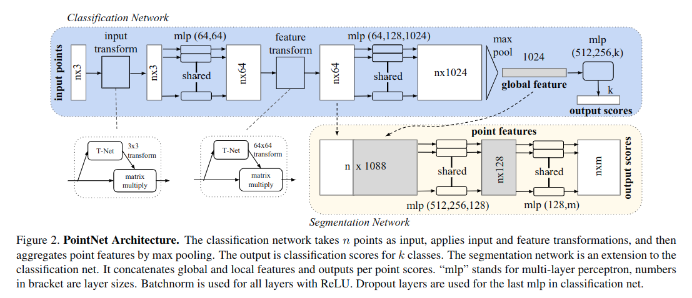

[π0.7: a Steerable Generalist Robotic Foundation Model with Emergent Capabilities](https://arxiv.org/pdf/2604.15483)
---------------	

__TL;DR__: blablablablabla

__keywords__: bla-bla

__Resources__: [[Github](https://github.com/Physical-Intelligence/openpi)] 

__Other Notable Info__: [Project Page](https://www.pi.website/blog/pi07)

<br/>    

General Comments:
------
* mixing all sources of data and condition on goals and contexts.
    - goals and contexts include launguage instructions, episode quality, control modality, subgoal images.
    - this really help the model to composte the concepts
    - the goals and contexts are new and rich prompting to robot models. Therefore, at its core, π0.7 is a diverse prompting stragegy, like the prompt expansion for video models and language models.
* compositional generalization is what's missing in the current status quo of robot learning.
* learning from mixed-quality data and non-standard data sources continue to be the trend of robot learning
* goal conditioning per say is not new, but using goal conditioning to enable model learning from all sources of data, and result in leapfrog performance improvement is new.
* one drawback is that zero-shot generalization is (unsurprisingly) lower than indistribution tasks

What's impressive results:
------
* enable a new robot fold laundry without seeing the task before
    - the caveat is the robot has been trained for other tasks
* perform chanllenging tasks like operating an espresso machine as good as specialized RL-finetuned models
* follow instructions that go against dataset biases, like reserse bussing. 
* cross-embodiment transfer: learning the shirt folding task from a small bimanual robot, while zero-shot transfer the skill to a big robot (UR5e) and perform better than teleoperators
* robot can perform new short-horizon tasks out of the box.
* robot can perform new long horizon tasks by listening to human step-by-step instructions (coaching)


Key ideas and technical details:
------
* still using knowledge insulation (KI), FAST tokens, and flow matching objectives, as previous PI models
* subgoal images: using multi-view subgoals resulting from different camera views, like base cameras and wrist cameras
* example prompt: 
```
<Multi-view observation><Multi-view subgoals>
Task: peel vegetables. Subtask: pick up the
peeler. Speed: 8000. Quality: 5. Mistake:
false. Control Mode: joint.<Proprioception>
```
* randomly drop part of the prompt during training as well. mixing the real future goal image with world model generated images to reduce the train-test mismatch
* the ablation study in this paper is very thorough. e.g. 1. split the dataset by quality and speed to see if model can learn effectively from mixed-quality data; 2. remove the 20% most diverse data verses randomly remove 20% data, this is to highlight the data diversity can help with model training.

My thoughts:
------
* making full use of all the sources of data, especially the egocentric human video data, is the unambiguous trend of 2026.
* the definition of dexterous task feel a bit hand-wavy now. The tasks like laundry folding and vegetable peeling requires wrist dexterity. tasks like operating scanner or using mouse requires finger dexterity. the PI approach can solve wrist dexterity very well, but still fall short in finger dexterity.
* the definition of embodiment also become a bit hand-wavy now. For UMI based approach, the embodiment means the end-effector only. only the end effector control and 6D pose trajectory matters. The robot arm is abstracted away and dealt with using IK or other optimization based low level controller. But for PI models, different robot arms are treated as different embodiment as the model directly predict joint control for the arms. The paper highlight an example of laundry folding, where the samller robot arm can pick up the clothes from the side, but the bigger and heavier arm is better suited to pick up clothes from the top. this is a very interesting observation. I think for the UMI like approach to work out, the robot arm, and even the whole body need to resemble the human as much as possible, so that the robot can reproduce the same human hand 6D pose movement easily. In short, if the robot body is sufficiently similar to human body, the joint control can be left to lower level controller to mimic human hand 6D pose movement.

* the goal conditioned approach, in my honest opionion, feel a bit hacky and less scalable. it makes the model learning easier, but it also makes the model susceptible to the quality of goal in the test time. the goal generation and trajectory generation become separated and modularized, and hence could become sub-optimal sometimes.

Questions:
------
* how well can the model generalize to using dexterous hand? The embodiment gap between gripper and dexterous hand might be too big for the model to generalize well.


Screenshots:
------
<!--  -->

