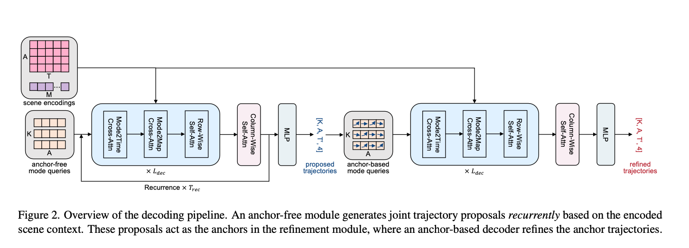

[QCNeXt: A Next-Generation Framework For Joint Multi-Agent Trajectory Prediction](https://arxiv.org/pdf/2306.10508.pdf) [arXiv]
---------------	

__TL;DR__: blablablablabla

__keywords__: TP

__Resources__: [[Github](https://github.com/ZikangZhou/QCNet)] 

<!-- __Other Notable Info__: [blabla](blabla) -->

     

General Comments:
------
* This is a followup work from QCNet, making some tweaks in decoder to optimize
for joint prediction problem.
* It has two main tweaks: 
  - Auto-regressive-alike prediction. Every embedding only accounts for 2sec
  predictions. The predicted embedding will be fed into the decoder again to predict the next 2sec.
  - Scene scoring module. Takes in the embedding of every modes for every agents,
  applying scene-level pooling (attentive pooling) to get one final scene embedding. Then the final embedding is used to generate joint prediction scores

Key ideas and technical details:
------
* The Mode2Time layer makes the mode embedding to attent to its historical embedding across time dimension.
* 

Other noteworthy points:
------
* 
* 

Questions:
------
* How to jointly score so many possibilities? The total number of possibilities
are K^n, where K is the mode and n is the number of agents
* 

Screenshots:
------

