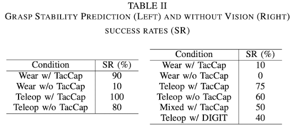

[TacCap: A Wearable FBG-Based Tactile Sensor for Seamless Human-to-Robot Skill Transfer](https://arxiv.org/pdf/2503.01789)
---------------	

__TL;DR__: A tactile sensing technology. Make it the same as in robot hand and
human wearable glove. The paper studied three problems: 1. sensor sensitivity
and response time; 2. reading consistency and variations in different sensors;
3. transfer gap between human demo and robotic execution

__keywords__: bla-bla

<!-- __Resources__: [[Github](blabla)]  -->

<!-- __Other Notable Info__: [Project Page](blabla) -->

     

General Comments:
------
* The ultimate goal is to bridge the gap between human demo and robot execution.
The paper did two tasks: 1. direct grasping tasks without vision input; 2. grasping
tasks from different poses with vision input.
* The result looks good. The most interesting group is learning from human demo,
and then deploy on robot hands. Though it performs worse than learning from teleop
data, but it is quit good.

Key ideas and technical details:
------
* How diffcult is the grasping task used in the experiments?
* How many human demo data is needed? If we increase the human demo data, will performance increase?
*

Other Thoughts
------
* TeleOp data is the best data, highest quality.
* Simulation data is low quality, due to 1. the robot - env interaction is not
real, because the subtle physics behind the interaction is very hard to  model;
2. the robot system is not real, for example, the latency, the sensing, the actuator,
are hard to simulate sometimes.
3. human demo can eliminate the physics gap. The robot system gap has to be bridged
by AI aglorithm.
* Two ways to bridge the gap: 1. learn from human demo and deploy on robot.
2. explicity transfer(upgrade) human demo data into robot demo data.

Other noteworthy points:
------
* 
* 

Screenshots:
------
<!--  -->

