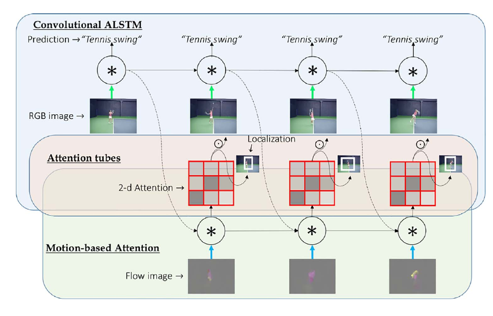

[VideoLSTM Convolves, Attends and Flows for Action Recognition](https://www.sciencedirect.com/science/article/pii/S1077314217301741)
======

__Publication__: CVIU 2016

__Affiliation__: University of Amsterdam

__Author__: [Zhenyang Li]

__Group__: University of Amsterdam

__Sources__: ([Github](https://github.com/zhenyangli/VideoLSTM)) 

     

__Rating__: 4/5
  

General Comments:
------
* Based on original convLSTM, attention model is added inside LSTM cells in a coherent way both spatially and temporally
* Theoretically, such attention model design makes a lot of sense, even though the experimental result didn't show much improvement
* The visualization and interpretation become convenient after the attention model. Localization can even be achieved from video-level class label only 

Main Innovations:
------
* spatial-temporal attention model inside convLSTM cell

Worth-noting:
------
* 
* 

Pictures:
------

