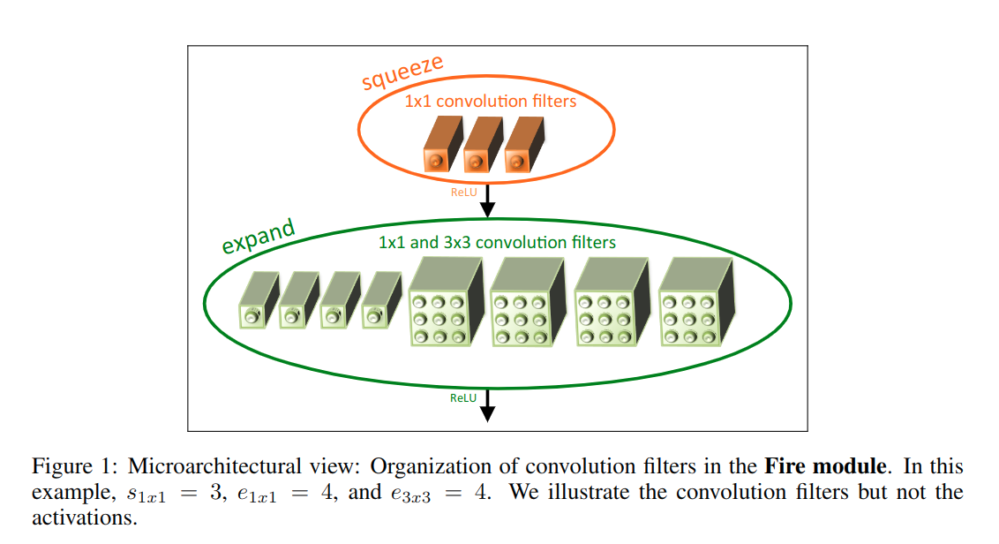

[SqueezeNet: AlexNet-level accuracy with 50x fewer parameters and <0.5MB model size](https://arxiv.org/abs/1602.07360)
======

__Publication__: 2016

__Affiliation__: Berkeley and Stanford

__Author__: Forrest N. Iandola

__Group__: Berkeley

__Sources__: ([Github](https://github.com/DeepScale/SqueezeNet)) ([Paper](https://arxiv.org/abs/1602.07360)) 
     

__Rating__: 5/5
  

General Comments:
------
* Based on inceptionNet. Also used a bundle of different sizes of filter at one layer together 
* Used 1 X 1 conv filter to do the compression

Main Innovations:
------
* Replace 3x3 filters with 1x1 filters.
* Decrease the number of input channels to 3x3 filters.
* Downsample late in the network so that convolution layers have large activationmaps. (This is based on experiment and intuition to improve the accuracy)

Worth-noting:
------
* Dropout (Srivastava et al., 2014) with a ratio of 50% is applied after the fire9 module
* the lack of fully-connected layers in SqueezeNet

Pictures:
------

