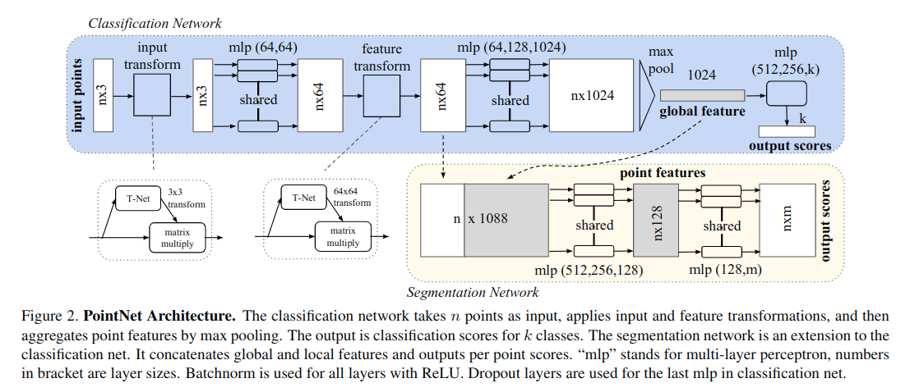

[Twisting Lids Off with Two Hands](https://arxiv.org/pdf/2403.02338) [CoRL24]
---------------	

__TL;DR__: blablablablabla

__keywords__: bla-bla

__Resources__: [[Github](blabla)] 

__Other Notable Info__: [Project Page](blabla)

     

General Comments:
------
* 
* 

Key ideas and technical details:
------
* exponiantial moving average (EMA) for action space
* interesting DR (domain randomization): PD controller, random force, 
frame lag and action lag
* ZeroMQ to sync messages

Other noteworthy points:
------
* 
* 

Screenshots:
------
<!--  -->

